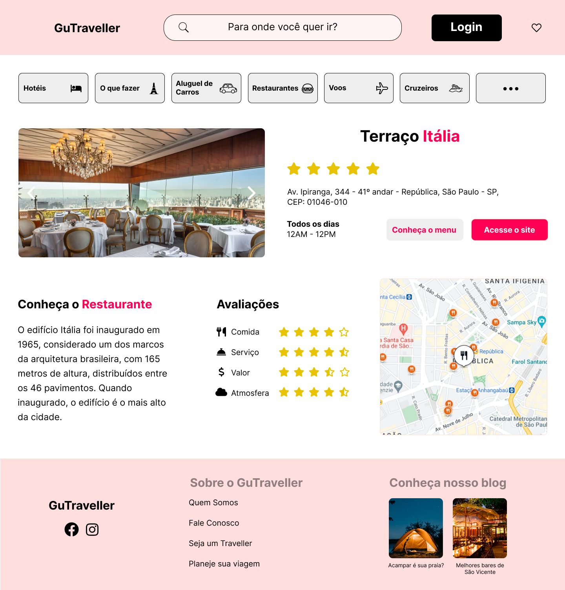

<h1 align="center"> API-Geolocalização </h1>

  <a href="#-tecnologias">Tecnologias</a>&nbsp;&nbsp;&nbsp;|&nbsp;&nbsp;&nbsp;
  <a href="#-projeto">Projeto</a>&nbsp;&nbsp;&nbsp;|&nbsp;&nbsp;&nbsp;
  <a href="#-layout">Layout</a>
 

  

## 🚀 Tecnologias

Esse projeto foi desenvolvido com as seguintes tecnologias:

- HTML e CSS
- JavaScript
- BootStrap
- Figma
- API Google Maps

## 💻 Projeto

 Integramos ao nosso projeto a API do Google Maps. Esta API permite a criação de mapas com locais definidos, controle de zoom, tipos de mapa, geração de rotas, pesquisa por estabelecimentos, e muitas coisas mais.
Desta forma, o usuário encontrará com facilidade o restaurante sugerido na página de restaurantes de nossa aplicação.

## 🔑 Configurar o projeto
Basta renomear a string "API_KEY" em service.js e script.js pela apikey gerada pelo cloud da google.

 Para criar uma chave de API, siga estas etapas:
- Na página do seletor de projetos através [DESSE LINK](https://console.cloud.google.com/projectselector2/home/dashboard?hl=pt-br&_gl=1*9t5yfm*_ga*NTA0MDIyMjUyLjE2OTM1MjI1MDA.*_ga_NRWSTWS78N*MTY5NDAzNTQ2OS4zLjAuMTY5NDAzNTQ3MC4wLjAuMA..&pli=1), no Console do Google Cloud, escolha ou crie um projeto do Google Cloud a que você quer adicionar uma chave de API.
- Acesse a página Plataforma Google Maps > Credenciais através [DESSE LINK](https://console.cloud.google.com/projectselector2/google/maps-apis/credentials?hl=pt-br&_gl=1*n8enif*_ga*NTA0MDIyMjUyLjE2OTM1MjI1MDA.*_ga_NRWSTWS78N*MTY5NDAzNTQ2OS4zLjAuMTY5NDAzNTQ3MC4wLjAuMA..).
- Na página Credenciais, clique em Criar credenciais > Chave de API.
A caixa de diálogo Chave de API criada exibirá sua chave recém-criada.
- Clique em Fechar.
A nova chave aparecerá na página Credenciais, em Chaves de API.
Lembre-se de restringir a chave de API antes de usá-la na produção.

## 🔖 Layout

Você pode visualizar o layout do projeto através [DESSE LINK](https://www.figma.com/file/IYo94wSsOnhXyyMrE7w2wR/Untitled?type=design&node-id=0-1&mode=design). É necessário ter conta no [Figma](https://figma.com) para acessá-lo.